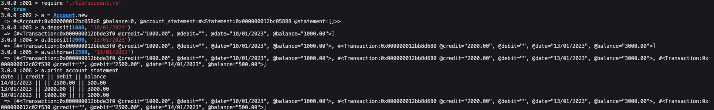
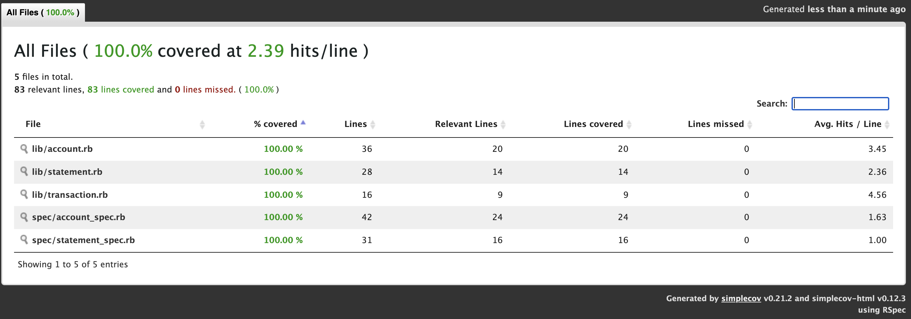

## Bank tech test
This programme is intended to simulate a cash machine which lets the user deposit/withdraw money and check their statement which includes transaction dates and balance.

Edge cases:
- The user is only allowed to withdraw money if their balance is greater than the withdrawal amount
- The user can only deposit/withdraw numbers, trying to input anything but a number will raise an error

### My approach:
- Initially I started with a single class but then extracted functionality to 2 additional ones.
- I believe I kept my code clear and concise with classes having sensbile functionality

### Technologies used:
- Ruby 3.0.0
- Rspec 3.10.0
- SimpleCov 0.21.2

### How to launch:
- Clone this repo
- Run bundle install
- Run IRB
- Type Require './lib/account.rb
- See below for how to interact with the programme.

### Test coverage
100% coverage according to SimpleCov
